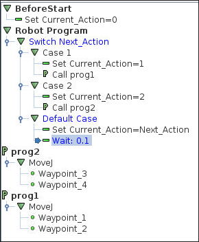
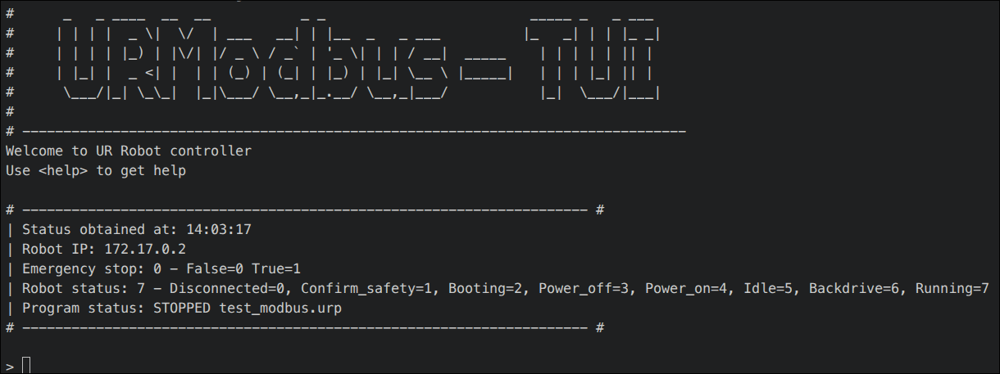
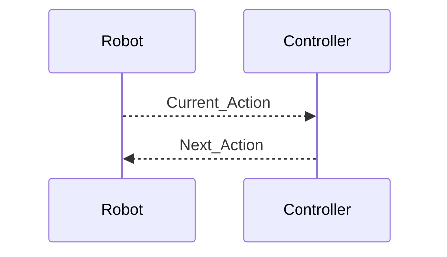

# ⚠️ Disclaimer

This repository is part of a research project **[ANR MITCH](https://anr.fr/Projet-ANR-24-CE10-3545)**.  
The provided code is **research-grade** and **not intended for industrial or safety‑critical deployment**.

---

# URModbus

**URModbus** enables external control of **Universal Robots (UR)** via the **Modbus** and **Dashboard** interfaces while keeping task logic on the robot itself.

The core idea is simple:

> ✨ _Program tasks directly on the teach pendant but manage execution and scheduling externally._

---

## ✅ Tested Configurations

**Offline**:
- UR CB3 Offline Simulator  
     [ursim cb3 docker](https://hub.docker.com/r/universalrobots/ursim_cb3) - Used for developing

**Online**:
- UR5 CB3.15 & OnRobot equipments - Used for validating:
    - [EYES](https://onrobot.com/fr/produits/onrobot-eyes) - [RG6](https://onrobot.com/fr/produits/prehenseur-rg6) - [HEX](https://onrobot.com/fr/produits/capteur-force-couple-6-axes-hex)

---

## ✨ Features

### Robot-side

- Tasks are implemented **directly on the teach pendant**
- A Modbus-based switch controls execution
- Robot publishes its current state continuously

### Controller-side

- External task scheduling and monitoring
- Execution timing and logging
- Interactive terminal-based control interface (TUI)

### Project Structure

|File|Description|
|---|---|
|**RobotController.py**|Main controller; manages task execution using a task queue|
|**TimeTracker.py**|Measures and logs task execution times|
|**ModbusTools.py**|Modbus communication layer|
|**DashTools.py**|Dashboard server interface|
|**ProcessTool.py**|Loads and manages task process files|
|**CommandServer.py**|Interactive terminal (TUI)|
|Constants.py|Settings for the code|

---

## 🚀 Quick Setup — Real Robot

### A) Robot Configuration

1. **Enable Modbus** on the robot
2. Create an **input word**
    - Address: `131`
    - Name: `Next_Action`
3. Create an **output word**
    - Address: `130`
    - Name: `Current_Action`
4. Create a program named **`test_modbus.urp`** containing a switch based on `Next_Action`

> ⚠️ Ensure:
> 
> - A **default case**
> - Proper **initial variable values**
> - Task `0` is reserved for _idle_

5. Start the program on the robot

---

### B) Code Setup

1. Clone the repository

```
git clone https://github.com/Le-Nain-Capable/URModbus.git
```

2. cd URModbus

3. Install dependencies
```
pip install -r requirements.txt
```
4. Configure `constants.py`

- Robot IP (real robot)
- OR container name (simulation)

5. Run the controller
```
python3 main.py
```
or
```
python3 -m URModbus
```
✅ The controller is now running.

---

### 🖥️ Command-Line Interface (TUI)

Open another terminal:
```
nc localhost 9999
```
You should see the interactive TUI.

- Type `play` **or**
- Start the UR program manually

---

## 🧠 How It Works

The system relies on **Modbus word exchange**:

- **`Next_Action`** → what the robot should do next
- **`Current_Action`** → what the robot is currently executing



### Task Model

- Each task is identified by a **unique integer**
- The integer corresponds to a `switch` case on the robot
- Example:
    - `1` → Pick part
    - `2` → Place part

### Mandatory Rules

- ✅ Set `Current_Action` at task start
- ✅ Always implement a **default case**
- ✅ Initialize all variables
- ⚠️ **Task `0` is strictly reserved for “Do Nothing”**

---

## ⚙️ Advanced Setup

### Configuration Constants (`constants.py`)

|Variable|Description|Default|
|---|---|---|
|MODE|`AUTO` or `MANUAL`|`AUTO`|
|AUTO_LOAD|Auto-load YAML based on UR program|`True`|
|TERMINAL_PORT|TUI port|`9999`|
|TERMINAL_HOST|TUI host|`127.0.0.1`|
|ROBOT_SLEEP_TIME|Loop sleep time (must match UR sleep!)|`0.1`|
|UR5_IP|Robot IP address|`192.168.1.10`|
|CONTAINER|URSim container name|`ursim`|
|DATA_DIR|Data folder|`data`|
|AUTOGEN_DIR|Time logs directory|`data/autogenerated`|
|TEST_FILE|Simulator YAML file|`test.yaml`|
|PROCESS_FILE|Real robot YAML file|`data.yaml`|
|MOTS|Modbus word mapping|see file|

---

### CB3 Docker Simulator

Ensure the container exposes:

- `502` (Modbus)
- `29999` (Dashboard)

Set the container name in `CONTAINER`.

---

## 📄 YAML Process Files

YAML files define task sequencing and dependencies.

**Example – `test_modbus.yaml`:**
```YAML
version: 0
name: Test
tasks:
    0:
        name: Intermediate
        requires: 
    1:
        name: Task 1
        requires: 0
    2: 
        name: Task 2
        requires: 1
ordering: [1,2]
```

> ⚠️ Task `0` is mandatory and acts as a safe idle state between tasks.

---

## 🔄 Execution Modes

### AUTO

- Executes tasks sequentially using `ordering`

### MANUAL

- Tasks must be injected dynamically by the user

### AUTO_LOAD

- If enabled:
    - Reads the active UR program name
    - Attempts to auto-load the matching YAML file
- Falls back to `TEST_FILE` or `PROCESS_FILE` if unavailable

---
